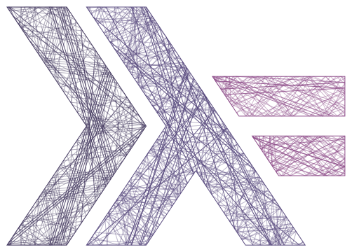

# Generative art using Haskell

This is me playing around with two-dimensional geometry and generative art using
Haskell and Cairo.

More examples are shown as results of the [visual test
suite](test/out/README.md).
