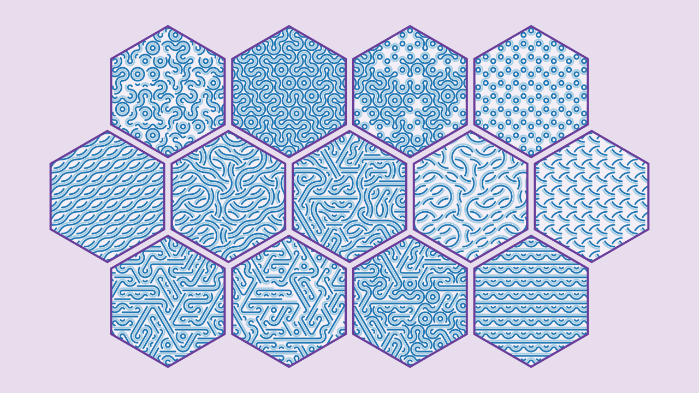
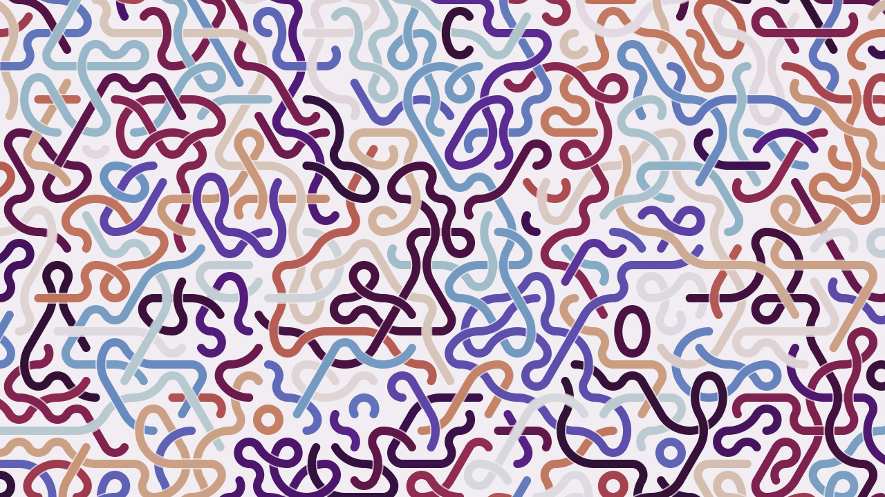
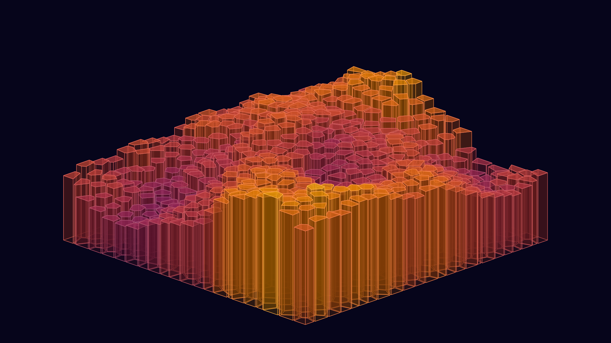

# Generative art using Haskell

[quchen](https://github.com/quchen) and [fmthoma](https://github.com/fmthoma)
playing around with 2-dimensional geometry and generative art using Haskell and
Cairo.

## Documentation

[Haddock of current master](https://quchen.github.io/generative-art/)

Some more documentation is also available in the [docs/](docs/README.md) folder.

## Showcases

