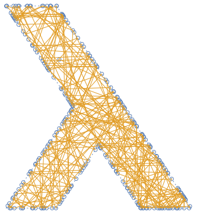
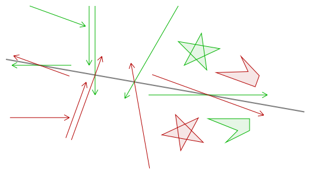
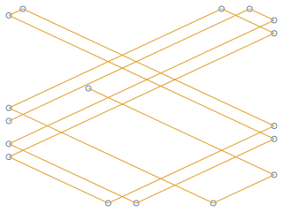

# Generative art using Haskell

This is me playing around with two-dimensional geometry and generative art using
Haskell and Cairo.

As part of the testsutie, I render images that hopefully look very wrong when I
break stuff. They’re also kind of nice to look at, at least if you’ve generated
them yourself. :-)

