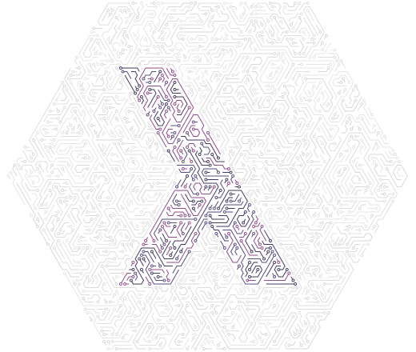
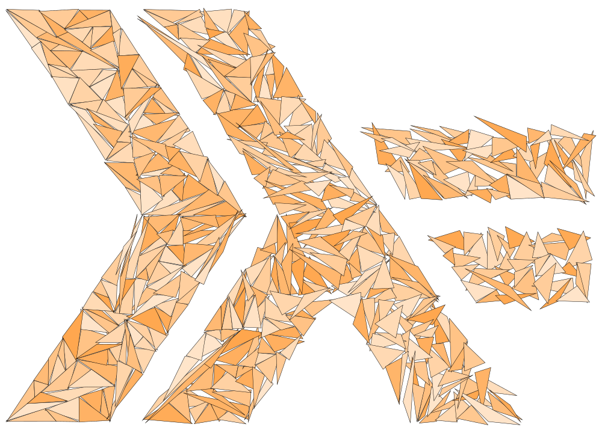
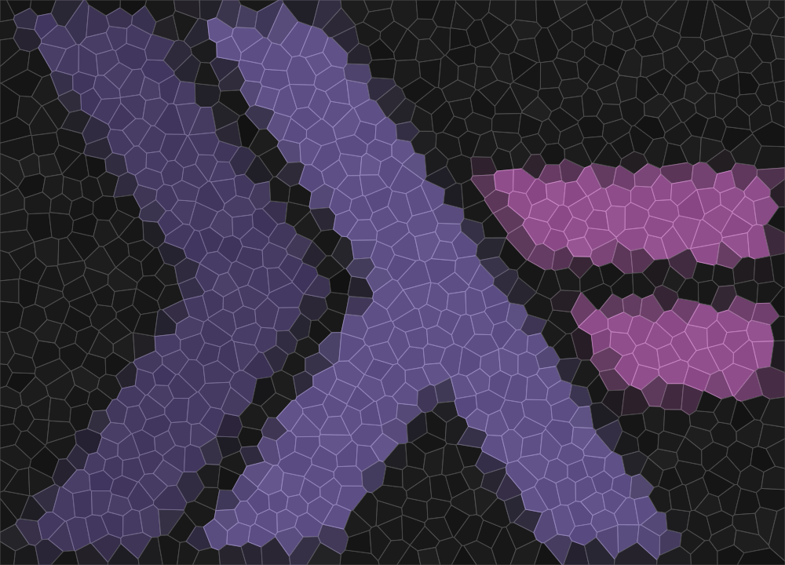

# Generative art using Haskell

[quchen](https://github.com/quchen) and [fmthoma](https://github.com/fmthoma)
playing around with 2-dimensional geometry and generative art using Haskell and
Cairo.

More examples are shown in the [docs/](docs/README.md) folder.
