<!-- This file was auto-generated by generate_readme.sh -->

# Visual testsuite

This file contains the SVG files generated by the visual testsuite to glance
over quickly.

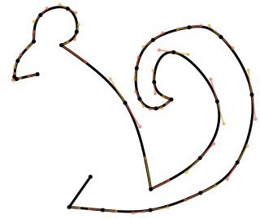

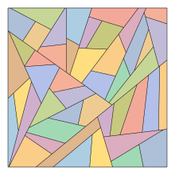

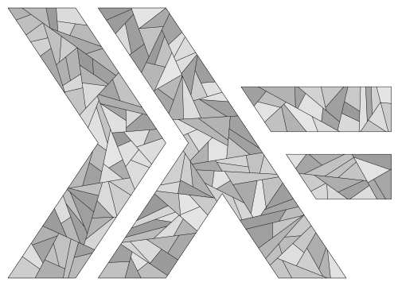

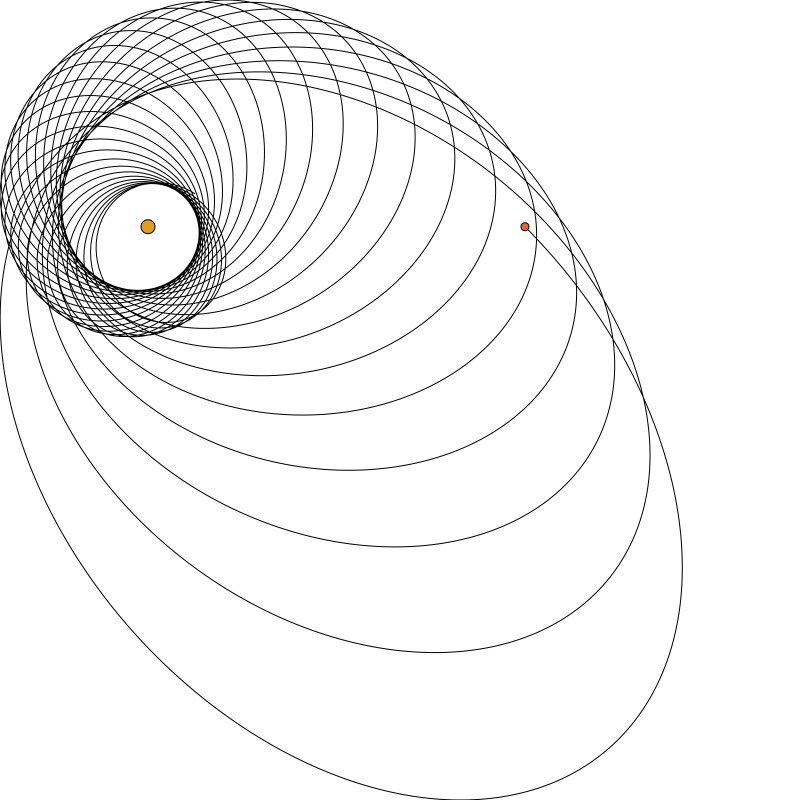

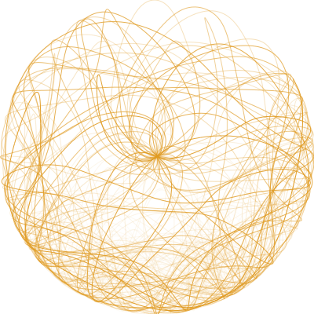

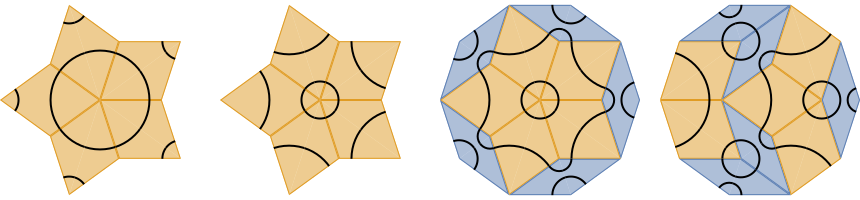

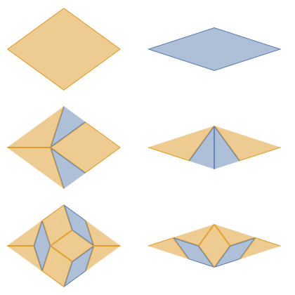

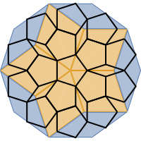

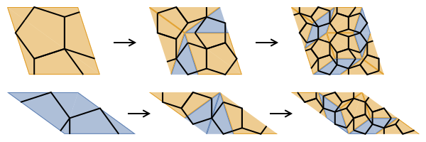

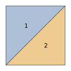

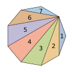

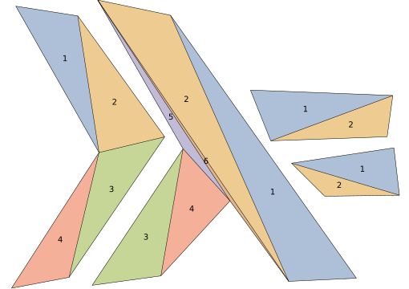

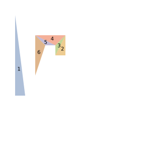

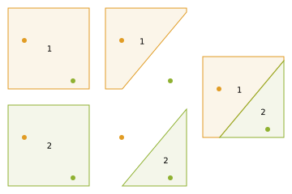

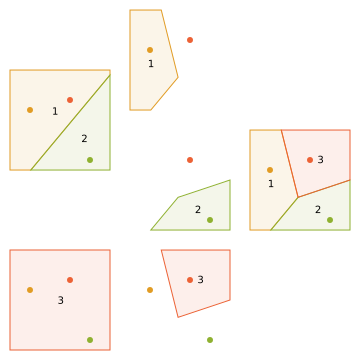

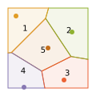
