<!-- This file was auto-generated by generate_readme.sh -->

# Visual testsuite

This file contains the example files generated by the visual testsuite to glance
over quickly.

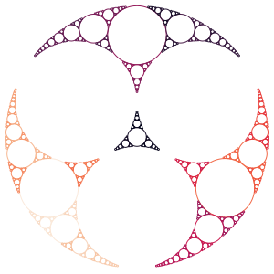

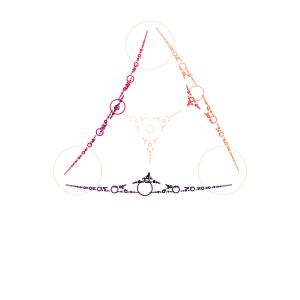

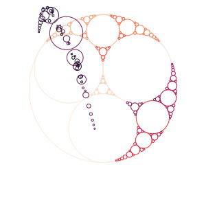

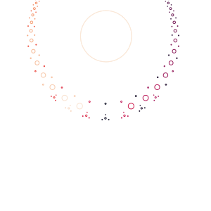

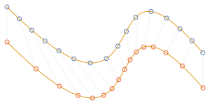

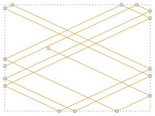

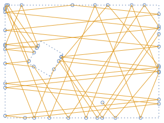

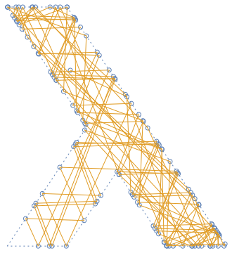

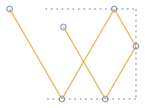

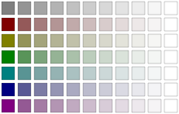

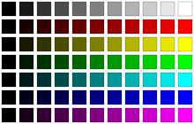

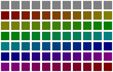

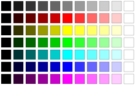

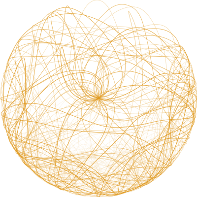

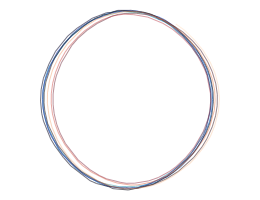

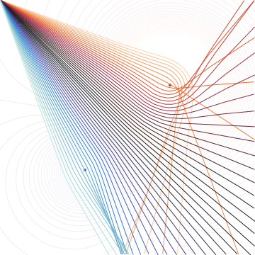

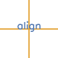

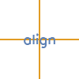

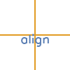

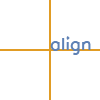

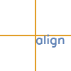

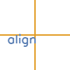

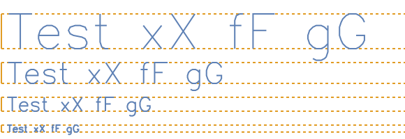

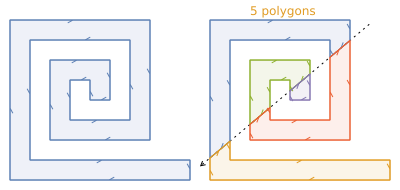

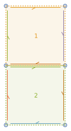

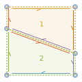

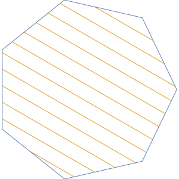

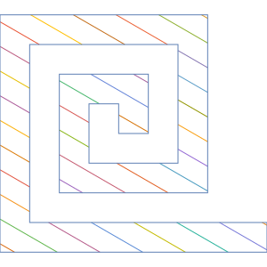

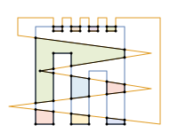

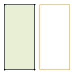

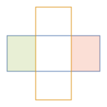

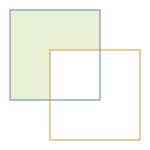

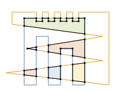

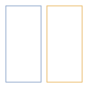

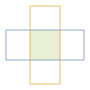

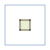

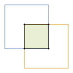

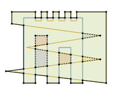

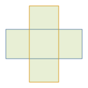

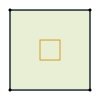

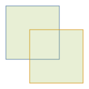

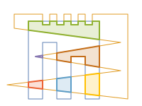

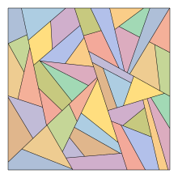

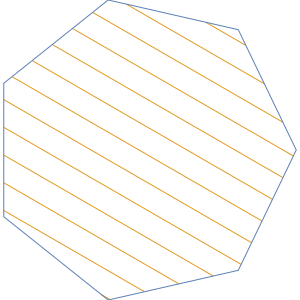

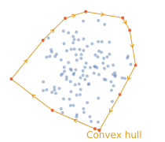

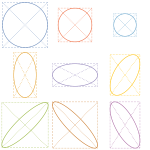

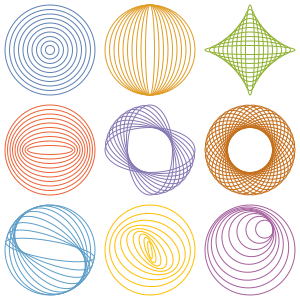

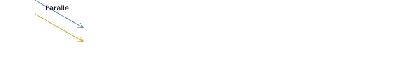

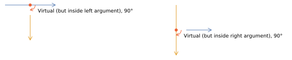

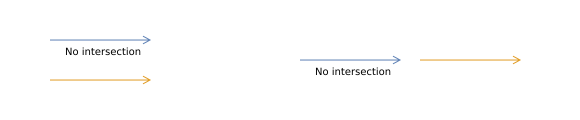

